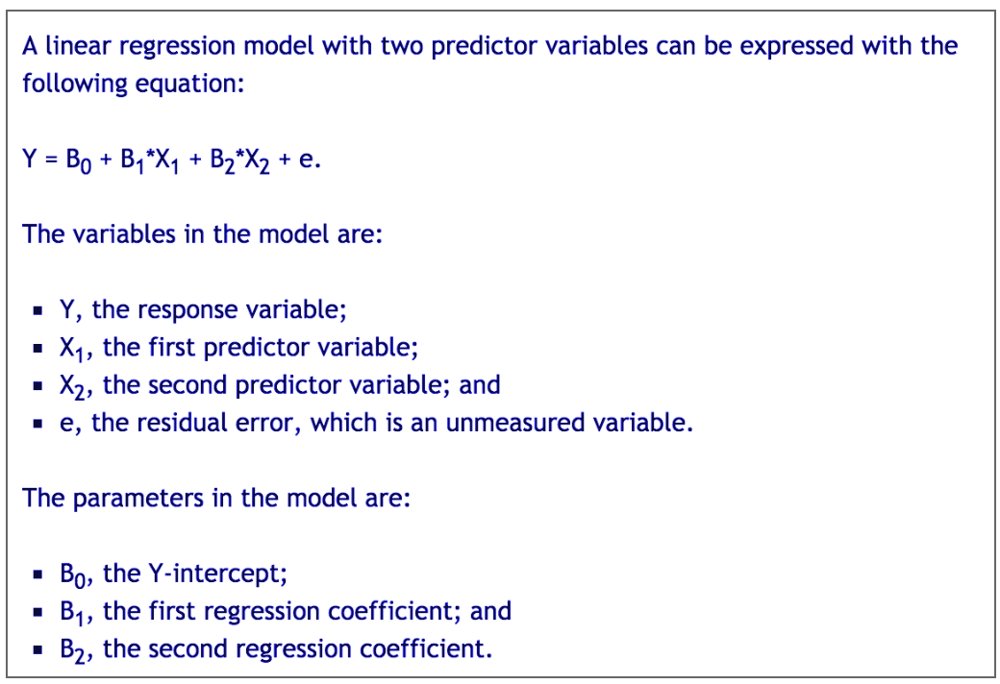

 
```{r setup, include=FALSE}
knitr::opts_chunk$set(echo = TRUE)
```

```{r load_libraries, include=FALSE}
library(knitr)
#\usepackage{mathtools}
```
# Introducción

<div style="text-align: justify">


En esta actividad se usará el fichero del **World Hapiness Report** ya preparado, es decir, después del preproceso que se ha realizado en la primera actividad. Recordad que con la instrucción: *read.csv("2016_clean.csv")* podéis leer el fichero en R.
Después de preparar el fichero y realizar los análisis propios de la estadística descriptiva e inferencial, se pasará a estudiar la causalidad.
Esta base de datos contiene 157 registros y 13 variables. Las variables son *Country, Region, HR, HS, LCI, UCI, GpC, Family, LE, Freedom, GC, Generosity, DR*. Son las mismas variables de la actividad 1 y de la actividad 2.
</div>

```{r chunck1}
# Loading the dataframe
df <- read.csv("2016_clean.csv")
head(df)
attach(df)
```

# 1. Modelo de regresión lineal
<div style="text-align: justify">
Primeramente, estudiaremos como cambia el nivel de felicidad en función de algunas características de cada país.
</div>

## 1.1 Modelo de regresión lineal múltiple (regresores cuantitativos)
<p style="text-align: justify">
Estimar por mínimos cuadrados ordinarios un modelo lineal que explique la puntuación de felicidad (HS) de un país en función de tres factores cuantitativos: el indicador de renta por cápita (GpC), la esperanza de vida en salud (LE) y la corrupción (GC).
</p>
Evaluar la bondad de ajuste a través del coeficiente de determinación (R2). Podéis usar la instrucción de R *lm*.

### Respuesta
<p style="text-align: justify">
Antes de contestar directamente la respuesta, me ha ocurrido de crear diagramas de dispersión para observar como quedaba la relación entre los atributos. En (a) y (b) se nota una existe una dependencia lineal con pendiente positiva. Mientras tanto, en (c) el patrón es un poco distinto, siendo que en general los valores más altos (con excepciones) de HS se concentran entre el valor 0.0 y 0.3 de GC. Sigue:
</p>
```{r chunck2}
library(ggplot2)

a <- ggplot(df, aes(x = GpC, y = HS)) + 
  geom_point(aes(color = GpC)) + xlab("GpC") + 
  ggtitle("(a) Happiness Score & Gross per Capita")
b <- ggplot(df, aes(x = LE, y = HS)) + 
  geom_point(aes(color = LE)) + xlab("LE") + 
  ggtitle("(b) Happiness Score & Life Expectancy")
c <- ggplot(df, aes(x = GC, y = HS)) + 
  geom_point(aes(color = GC)) + xlab("GC") + 
  ggtitle("(c) Happiness Score & Government Corruption")

a
b
c


#Solución del problema
m1 <- lm(formula =  HS ~ GpC + LE + GC, data = df)
m1
summary(m1)
```

<p style="text-align: justify">
En las output arriba tenemos nuestro modelo y, además, en la salida del summary, podemos observar **`r summary(m1)$r.sq`** como *ajuste del coeficiente de determinación (R2)*.
</p>

## 1.2 Modelo de regresión lineal múltiple (regresores cuantitativos y cualitativos)
<p style="text-align: justify">
Estimar por mínimos cuadrados ordinarios un modelo lineal que explique la puntuación de felicidad (HS) de un país en función de cuatro factores. Además de los tres anteriores (renta, esperanza de vida y corrupción) ahora se añade la región del mundo (región). Usar como categoría de referencia la región “*Western Europe*”
(para ello usar el factor combinado con relevel(region, ref = “*Western Europe*”)).
</p>
<p style="text-align: justify">
Evaluar la bondad del ajuste a través del coeficiente de determinación (R2) y comparar el resultado de este model con el obtenido en el apartado 1.1. Podéis usar la instrucción de R *lm* y usar el coeficiente R-cuadrado ajustado en la comparación. Interpretar también el significado de los coeficientes obtenidos y su significación estadística.
</p>

### Respuesta
```{r chunck3}
df2 <- df
str(df2$Region)
DF <- within(df2, Region <- relevel(Region, ref = "Western Europe"))
detach(df)
attach(df2)
m2 <- lm(HS ~ GpC + LE + GC + Region, data = df2)
m2
summary(m2)$r.sq
summary(m2)

```
<p style="text-align: justify">
La bondad del ajuste a través del coeficiente de determinación es igual a: **`r summary(m2)$r.sq`**.
</p>


```{r chunck4}
models <- c("Apartado 1.1", "Apartado 1.2")
ajuste <- c(summary(m1)$r.sq, summary(m2)$r.sq)
dfE <- data.frame('Apartados'=models,'Bondad del Ajuste'=as.vector(ajuste))

library(pander)
pander(dfE)
```

<p style="text-align: justify">
Según Quick (2009) [1], de las salidas de nuestros modelos (coeficientes, entre otros) podemos determinar la ecuación de regresión completa. Para aportar un poco más a su visión, miramos una imagen.
</p>

<p style="text-align: justify">
Por lo tanto, para el ejemplo del apartado 1.1 tendremos:
</p>

*(Intercept)* = 2.983163
</p>
<p style="text-align: justify">
*Residual standard error* = 0.6401
</p>
<p style="text-align: justify">
Y una vez definidos tales valores, podemos seguir con la ecuación para el modelo.
</p>
####*Happinness Score* = 2.983163 + 1.238082 * GpC + 1.716585 * LE + 1.895315 * GC + 0.6401


Una vez definida la ecuación, hay que echar un vistazo en los coeficientes de los dos modelos antes interpretar:

```{r chunck5}
coef(m1)
coef(m2)
```

<p style="text-align: justify">
Teniendo en cuenta que el **coeficiente de correlación sirve para medir el grado en que dos variables tienden a cambiar al mismo tiempo**, para interpretar los coeficientes arriba, podemos seguir la recomendación de Schweiger (2016) [3], para las variables cuantitativas (dos variables continuas), como las del ejercicio 1.1 y parte del ejercicio 1.2, utilizamos la **correlación del producto de Pearson**: un cambio en una variable se asocia con un cambio proporcional en la otra variable.
</p>
<p style="text-align: justify">
En las regresiones con múltiples variables independientes, el coeficiente nos dice cuánto se espera que aumente la variable dependiente cuando esa variable independiente aumenta en uno, manteniendo constantes todas las demás variables independientes.
</p>

<p style="text-align: justify">
Sin más preámbulos, no podemos olvidarnos de los coeficientes que resultaron de la referencia categórica de la región *“Western Europe”*. Los valores de coeficiente, aún siguiendo la recomendación de Grace-Martin (2016) [2], representan la media de diferencia en HS entre la categoría de referencia (region Western Europe) y la categoría de comparación.
</p>
<p style="text-align: justify">
##1.3 Efectuar una predicción del índice de felicidad en los dos modelos
</p>
<p style="text-align: justify">
Suponer un país de la región de Europa Occidental (Western Europe), con una renta de 1.5, una esperanza de vida en salud del 69% y un índice de corrupción de 0.35. Realizar la predicción con los dos modelos. Interpretar los resultados.
</p>

### Respuesta

```{r chunck6}
exercise.1.3 <- data.frame(LE=0.69, GC=0.35, GpC=1.5, Region="Western Europe")
predict(m1, exercise.1.3)
predict(m2, exercise.1.3)

```

<p style="text-align: justify">
Como observamos, para los parámetros de entrada dados, la salida para el primero modelo es **`r predict(m1, exercise.1.3)`** - mientras para el segundo  **`r predict(m1, exercise.1.3)`** - si consideramos que en la medida en que incorporamos un mayor número de variables independientes al modelo, lo hacemos más asertivo (esto es, predece con menos errores) la interpretación es de que la salida del segundo modelo, aunque él sea también más complejo, es la más buena.
</p>

##1.4 Cálculos de dispersión manuales
<p style="text-align: justify">
aaaaaaa
</p>
<p style="text-align: justify">
aaaaaaa
</p>
### Respuesta
```{r chunck7}

```
<hr />
# 2. Estadística Inferencial
<div style="text-align: justify">

## 2.1 Media de HS de todos los países
<p style="text-align: justify">
aaaaaaa
</p>
<p style="text-align: justify">
aaaaaaa
</p>
<p style="text-align: justify">
aaaaaaa
</p>
<p style="text-align: justify">
aaaaaaa
</p>

#### Respuesta
### 2.1.1 Escribir la hipótesis nula y alternativa


### 2.1.2 Escribir qué tipo de contraste aplicaréis
<p style="text-align: justify">
aaaaaaa
</p>
<p style="text-align: justify">
aaaaaaa
</p>

### 2.1.3 Realizar los cálculos del contraste de hipótesis: calcular el estadístico de contraste observado y el valor crítico
<p style="text-align: justify">
aaaaaaa
</p>

```{r chunck8}

```
<p style="text-align: justify">
aaaaaaa
</p>


## Referencias
<p style="text-align: justify">
[1] Quick, M. (2009) *"R Tutorial Series: Multiple Linear Regression"*. [artículo en línea]. [Fecha de consulta: 09 de mayo del 2018]. 
https://www.r-bloggers.com/r-tutorial-series-multiple-linear-regression/
</p>
<p style="text-align: justify">
[1] Grace-Martin, K. (2016) *"Interpreting Regression Coefficients"*. [artículo en línea]. [Fecha de consulta: 09 de mayo del 2018]. 
https://www.theanalysisfactor.com/interpreting-regression-coefficients/
</p>
<p style="text-align: justify">
[3] Schweiger (2016) - University of Bayreuth *"Can I use Pearson’s correlation coefficient to know the relation between perception and gender, age, income?"* [artículo en línea]. [Fecha de consulta: 10 de mayo del 2018]. 
https://www.researchgate.net/post/Can_I_use_Pearsons_correlation_coefficient_to_know_the_relation_between_perception_and_gender_age_income
</p>


