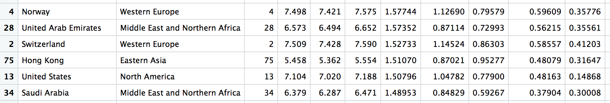

 
```{r setup, include=FALSE}
knitr::opts_chunk$set(echo = TRUE)
```

```{r load_libraries, include=FALSE}
library(knitr)
library(pander)
#\usepackage{mathtools}
```
# Introducción

<div style="text-align: justify">


En esta actividad se usará el fichero del **World Hapiness Report** ya preparado, es decir, después del preproceso que se ha realizado en la primera actividad. Recordad que con la instrucción: *read.csv("2016_clean.csv")* podéis leer el fichero en R.
Después de preparar el fichero y realizar los análisis propios de la estadística descriptiva e inferencial, se pasará a estudiar la causalidad.
Esta base de datos contiene 157 registros y 13 variables. Las variables son *Country, Region, HR, HS, LCI, UCI, GpC, Family, LE, Freedom, GC, Generosity, DR*. Son las mismas variables de la actividad 1 y de la actividad 2.
</div>

```{r chunck1}
# Loading the dataframe
df <- read.csv("2016_clean.csv")
head(df)
attach(df)
```

# 1. Modelo de regresión lineal
<div style="text-align: justify">
Primeramente, estudiaremos como cambia el nivel de felicidad en función de algunas características de cada país.
</div>

## 1.1 Modelo de regresión lineal múltiple (regresores cuantitativos)
<p style="text-align: justify">
Estimar por mínimos cuadrados ordinarios un modelo lineal que explique la puntuación de felicidad (HS) de un país en función de tres factores cuantitativos: el indicador de renta por cápita (GpC), la esperanza de vida en salud (LE) y la corrupción (GC).
</p>
Evaluar la bondad de ajuste a través del coeficiente de determinación (R2). Podéis usar la instrucción de R *lm*.

### Respuesta
<p style="text-align: justify">
Antes de contestar directamente la respuesta, me ha ocurrido de crear diagramas de dispersión para observar como quedaba la relación entre los atributos. En (a) y (b) se nota una existe una dependencia lineal con pendiente positiva. Mientras tanto, en (c) el patrón es un poco distinto, siendo que en general los valores más altos (con excepciones) de HS se concentran entre el valor 0.0 y 0.3 de GC. Sigue:
</p>
```{r chunck2}
library(ggplot2)

a <- ggplot(df, aes(x = GpC, y = HS)) + 
  geom_point(aes(color = GpC)) + xlab("GpC") + 
  ggtitle("(a) Happiness Score & Gross per Capita")
b <- ggplot(df, aes(x = LE, y = HS)) + 
  geom_point(aes(color = LE)) + xlab("LE") + 
  ggtitle("(b) Happiness Score & Life Expectancy")
c <- ggplot(df, aes(x = GC, y = HS)) + 
  geom_point(aes(color = GC)) + xlab("GC") + 
  ggtitle("(c) Happiness Score & Government Corruption")

a
b
c


#Solución del problema
m1 <- lm(formula =  HS ~ GpC + LE + GC, data = df)
m1
summary(m1)
```

<p style="text-align: justify">
En las output arriba tenemos nuestro modelo y, además, en la salida del summary, podemos observar **`r summary(m1)$r.sq`** como *ajuste del coeficiente de determinación (R2)*.
</p>

## 1.2 Modelo de regresión lineal múltiple (regresores cuantitativos y cualitativos)
<p style="text-align: justify">
Estimar por mínimos cuadrados ordinarios un modelo lineal que explique la puntuación de felicidad (HS) de un país en función de cuatro factores. Además de los tres anteriores (renta, esperanza de vida y corrupción) ahora se añade la región del mundo (región). Usar como categoría de referencia la región “*Western Europe*”
(para ello usar el factor combinado con relevel(region, ref = “*Western Europe*”)).
</p>
<p style="text-align: justify">
Evaluar la bondad del ajuste a través del coeficiente de determinación (R2) y comparar el resultado de este model con el obtenido en el apartado 1.1. Podéis usar la instrucción de R *lm* y usar el coeficiente R-cuadrado ajustado en la comparación. Interpretar también el significado de los coeficientes obtenidos y su significación estadística.
</p>

### Respuesta
```{r chunck3}
df2 <- df
str(df2$Region)
df2 <- within(df2, Region <- relevel(Region, ref = "Western Europe"))
detach(df)
attach(df2)
m2 <- lm(HS ~ GpC + LE + GC + Region, data = df2)
m2
summary(m2)$r.sq
summary(m2)

```
<p style="text-align: justify">
La bondad del ajuste a través del coeficiente de determinación es igual a: **`r summary(m2)$r.sq`**.
</p>


```{r chunck4}
models <- c("Apartado 1.1", "Apartado 1.2")
ajuste <- c(summary(m1)$r.sq, summary(m2)$r.sq)
dfE <- data.frame('Apartados'=models,'Bondad del Ajuste'=as.vector(ajuste))

pander(dfE)
```

<p style="text-align: justify">
Según Quick (2009) [1], de las salidas de nuestros modelos (coeficientes, entre otros) podemos determinar la ecuación de regresión completa. Para aportar un poco más a su visión, miramos una imagen.
</p>

<p style="text-align: justify">
Por lo tanto, para el ejemplo del apartado 1.1 tendremos:
</p>

*(Intercept)* = 2.983163
</p>
<p style="text-align: justify">
*Residual standard error* = 0.6401
</p>
<p style="text-align: justify">
Y una vez definidos tales valores, podemos seguir con la ecuación para el modelo.
</p>
####*Happinness Score* = 2.983163 + 1.238082 * GpC + 1.716585 * LE + 1.895315 * GC + 0.6401


Una vez definida la ecuación, hay que echar un vistazo en los coeficientes de los dos modelos antes interpretar:

```{r chunck5}
coef(m1)
coef(m2)
```

<p style="text-align: justify">
Teniendo en cuenta que el **coeficiente de correlación sirve para medir el grado en que dos variables tienden a cambiar al mismo tiempo**, para interpretar los coeficientes arriba, podemos seguir la recomendación de Schweiger (2016) [3], para las variables cuantitativas (dos variables continuas), como las del ejercicio 1.1 y parte del ejercicio 1.2, utilizamos la **correlación del producto de Pearson**: un cambio en una variable se asocia con un cambio proporcional en la otra variable.
</p>
<p style="text-align: justify">
En las regresiones con múltiples variables independientes, el coeficiente nos dice cuánto se espera que aumente la variable dependiente cuando esa variable independiente aumenta en uno, manteniendo constantes todas las demás variables independientes.
</p>

<p style="text-align: justify">
Sin más preámbulos, no podemos olvidarnos de los coeficientes que resultaron de la referencia categórica de la región *“Western Europe”*. Los valores de coeficiente, aún siguiendo la recomendación de Grace-Martin (2016) [2], representan la media de diferencia en HS entre la categoría de referencia (region Western Europe) y la categoría de comparación.
</p>
<p style="text-align: justify">
##1.3 Efectuar una predicción del índice de felicidad en los dos modelos
</p>
<p style="text-align: justify">
Suponer un país de la región de Europa Occidental (Western Europe), con una renta de 1.5, una esperanza de vida en salud del 69% y un índice de corrupción de 0.35. Realizar la predicción con los dos modelos. Interpretar los resultados.
</p>

### Respuesta

```{r chunck6}
exercise.1.3 <- data.frame(LE=0.69, GC=0.35, GpC=1.5, Region="Western Europe")
predict(m1, exercise.1.3)
predict(m2, exercise.1.3)

```

<p style="text-align: justify">
Como observamos, para los parámetros de entrada dados, la salida para el primero modelo es **`r predict(m1, exercise.1.3)`** - mientras para el segundo  **`r predict(m1, exercise.1.3)`** - si consideramos que en la medida en que incorporamos un mayor número de variables independientes al modelo, lo hacemos más asertivo (esto es, predece con menos errores) la interpretación es de que la salida del segundo modelo, aunque él sea también más complejo, es la más buena.
</p>

<hr />
# 2. Modelo de regresión logística
<p style="text-align: justify">
Se desea evaluar el fenómeno de la felicidad desde un punto de vista de qué países son los 32 más felices. Por tanto, se evaluará la probabilidad de que un país del mundo esté entre este grupo de los 32 más felices. Para evaluar esta probabilidad se aplicará un modelo de regresión logística, donde la variable depediente será una variable binaria que indicará si el país tiene un lugar en el ránquing de los mejores 32 (donde la posición 32 está incluida). Se usará la muestra disponible para estimar el modelo con las mismas variables que en el modelo 1.1.
</p>
## 2.1 Estimación de un modelo de regresión logística

<p style="text-align: justify">
Estimar el modelo de regresión logística donde la variable dependiente es “best” y las explicativas son el indicador de renta por cápita (GpC) y la corrupción (GC). No incluimos la esperanza de vida puesto que pensamos que queda ya representada con la riqueza en la renta por cápita.
</p>
<p style="text-align: justify">
Evaluar si alguno de los regresores tiene influencia significativa (p-valor del contraste individual inferior al 5%).
</p>

### Respuesta
```{r chunck7}
df <- read.csv("2016_clean.csv")
df$best <- ifelse(df$HR <= 32, TRUE, FALSE)
attach(df)
contrasts(best)
# 0 FOR FALSE / 1 FOR TRUE (FOR THE BEST 32 COUNTRIES)
m3 <- glm(best ~ GpC + GC,family = binomial, data = df)
m3
summary(m3)
```

Sobre la influencia significativa, observamos que **GC** tiene p-valor de apenas **`r coef(summary(m3))[row.names(coef(summary(m3))) %in% "GC" , 4]`** 
```{r chunck8}
coef(summary(m3))[row.names(coef(summary(m3))) %in% "GC" , 4]
coef(summary(m3))[row.names(coef(summary(m3))) %in% "GpC" , 4]
```


## 2.2 Predicción en el modelo lineal generalizado (modelo de regresión logística)
<p style="text-align: justify">
Usando el modelo anterior, calculad la probabilidad de ser uno dels 32 países más felices del mundo para un país que tiene una renta de 1.5, y un índice de corrupción de 0.35.
</p>
### Respuesta
```{r chunck9}
new.df <- data.frame(GpC = 1.5, GC = 0.35)
predict(m3, new.df, type = "response")
```
<p style="text-align: justify">
Basado en los resultados, la probabilidad es de **`r predict(m3, new.df, type = "response")`**. 
</p>
<p style="text-align: justify">
Si nos concentramos un poco en el *dataframe* inicial, hay un país que tiene condiciones muy parecidas a estas. Miramos:
</p>

<p style="text-align: justify">
Aunque no tengamos una situación totalmente igual, podemos notar que la mayoría de los países con variables de GpC y GC alrededor de los valores pasados suelen estar entre los 32 países más felices (o muy cerca de llegar a esto, como Saudi Arabia). Posteriormente vamos a investigar si hay como mejorar las estimativas.
</p>


## 2.3 Mejora del modelo
<p style="text-align: justify">
Buscar un modelo mejor al anterior añadiendo más variables explicativas. Se realizarán las siguientes pruebas:
</p>
<p style="text-align: justify">
Modelo regresor que añade al anterior la variable libertad (Freedom).
</p>
<p style="text-align: justify">
Modelo regresor que añade la región.
</p>
<p style="text-align: justify">
Modelo regresor que añade libertad y región.
</p>
<p style="text-align: justify">
Decidir si se prefiere el modelo inicial o bien uno de los modelos con freedom, con región, o con ambas. El criterio para decidir el mejor modelo es **AIC**. Cuanto más pequeño es AIC mejor es el modelo.
</p>
### Respuesta
```{r chunck10}
m4 <- glm(best ~ GpC + GC + Freedom, family = binomial, data = df)
m5 <- glm(best ~ GpC + GC + Region, family = binomial, data = df)
m6 <- glm(best ~ GpC + GC + Freedom + Region, family = binomial, data = df)

models.id <- c("m3", "m4", "m5", "m6")
models <- c("Inicial (GpC + GC)", "Inicial + Freedom", "Inicial + Region", "Inicial + Freedom + Region")
aics <- c(AIC(m3), AIC(m4), AIC(m5), AIC(m6))

pander(data.frame('ID'=models.id, 'Modelos'=models,'AIC'=as.vector(aics)))
```
<p style="text-align: justify">
Dados los requerimientos (*cuanto más pequeño es AIC mejor es el modelo*) desde mi punto de vista, el último modelo **m6** incluyendo *GpC + GC + Freedom + Region* es el más adecuado.
</p>

## 2.4 Calidad del ajuste
<p style="text-align: justify">
Calcular la matriz de confusión del mejor modelo del apartado 2.3 suponiendo un umbral de discriminación del 80%. Observad cuantos falsos negativos hay e interpretar qué es un falso negativo en este contexto.
</p>
### Respuesta
```{r chunck11}
model.probs = predict(m6, type="response")

model.pred = rep(FALSE, nrow(df)) #1st crear un vector de N FALSE elementos.
threshold <- 0.8 # suponiendo un umbral de discriminación del 80%
model.pred[model.probs >= threshold] = TRUE # Transformar a TRUE predicciones que superan probabilidad del umbral.

# Crear la matriz de confusión
table(model.pred, best)
```
<p style="text-align: justify">
Algunas interpretaciones de nuestra matriz de confusión:
</p>
  + **Precisión**: aciertos / casos totales: (123 + 20)/`r nrow(df)` = `r (123 + 20)/nrow(df)`


<p style="text-align: justify">
Los errores de tipo II también llamados *falsos negativos* son aquellos que se predice 0 (en nuestro caso, *FALSE*, "no en la lista de los 32 mejores") cuando en realidad era 1 (*TRUE*). Recapitulando la nuestra última actividad: **cuando aceptas una falsa hipótesis nula.**</p>

## 2.5 La selección de los mejores países
<p style="text-align: justify">
Establecer un nivel de probabilidad (umbral de discriminación a partir del cual pensáis que el país tiene muchas posibilidades de estar entre los mejores, por ejemplo podéis escoger el 80%). Comparar el nivel de probabilidad que da el modelo con el ránquing del país e identificar los países que no se comportan según lo esperado. Podéis realizar este estudio gráficamente.
</p>
### Respuesta
```{r, out.width="1000px", out.height="1000px"}
df$predicted = model.probs
detach(df)
detach(df2)
df.filtered <- df[which(df$predicted >=threshold),]
attach(df.filtered)
with(df.filtered, plot(HR ~ predicted, col = ifelse(HR > 32,'red','green'), pch = 19))
text(HR ~ predicted, labels=paste(HR, "-", Country), cex= 0.4)
```
<p style="text-align: justify">
Para destacar las predicciones con un umbral de `r threshold*100`% que no eran adecuadas, he puesto colores en rojo y podemos notar dos ocurrencias. Sin embargo, estas no son el único error del modelo - hay valores que deberían tener sido predecidos como Best Country y no fueron.
</p>
<p style="text-align: justify">
Para intentar una otra aproximación e investigar de una nueva perspectiva, también voy a extraer los datos de un otro modelo (anteriormente definido m5).
</p>
```{r, out.width="1000px", out.height="1000px"}
model.probsM5 = predict(m5, type="response")
model.predM5 = rep(FALSE, nrow(df)) #1st crear un vector de N FALSE elementos.
model.predM5[model.probsM5 >= threshold] = TRUE # Transformar a TRUE predicciones que superan probabilidad del umbral.
detach(df.filtered)
attach(df)

df$predictedM5 = model.probsM5
detach(df)
df.filteredM5 <- df[which(df$predictedM5 >=threshold),]
attach(df.filteredM5)
with(df.filteredM5, plot(HR ~ predictedM5, col = ifelse(HR > 32,'red','green'), pch = 19))
text(HR ~ predictedM5, labels=paste(HR, "-", Country), cex= 0.4)
```
<p style="text-align: justify">
Como se nota, hubo pocos cambios en el resultado anterior - ahora en vez de 2 ítems incorrectos, tenemos solamente 1, sumando que el threshold sigue el mismo, podemos decir que la previsión ha sido más asertiva.</p>
## 2.6 Curva ROC
<p style="text-align: justify">
Realizar el dibujo de la curva ROC (usando la librería pROC [4] y la instrucción **roc** y el plot del objeto resultante). Calcular AUROC usando también este paquete, auc(...) donde debéis pasar el nombre del objeto roc. Interpretar el resultado.
</p>
### Respuesta


## Referencias
<p style="text-align: justify">
[1] Quick, M. (2009) *"R Tutorial Series: Multiple Linear Regression"*. [artículo en línea]. [Fecha de consulta: 09 de mayo del 2018]. 
https://www.r-bloggers.com/r-tutorial-series-multiple-linear-regression/
</p>
<p style="text-align: justify">
[1] Grace-Martin, K. (2016) *"Interpreting Regression Coefficients"*. [artículo en línea]. [Fecha de consulta: 09 de mayo del 2018]. 
https://www.theanalysisfactor.com/interpreting-regression-coefficients/
</p>
<p style="text-align: justify">
[3] Schweiger (2016) - University of Bayreuth *"Can I use Pearson’s correlation coefficient to know the relation between perception and gender, age, income?"* [artículo en línea]. [Fecha de consulta: 10 de mayo del 2018]. 
https://www.researchgate.net/post/Can_I_use_Pearsons_correlation_coefficient_to_know_the_relation_between_perception_and_gender_age_income
</p>
<p style="text-align: justify">
[4] Xavier Robin, Natacha Turck, Alexandre Hainard, Natalia Tiberti, Frédérique Lisacek, Jean-Charles Sanchez and Markus Müller (2011). pROC: an
  open-source package for R and S+ to analyze and compare ROC curves. BMC Bioinformatics, 12, p. 77.  DOI: 10.1186/1471-2105-12-77
  <http://www.biomedcentral.com/1471-2105/12/77/>
</p>


